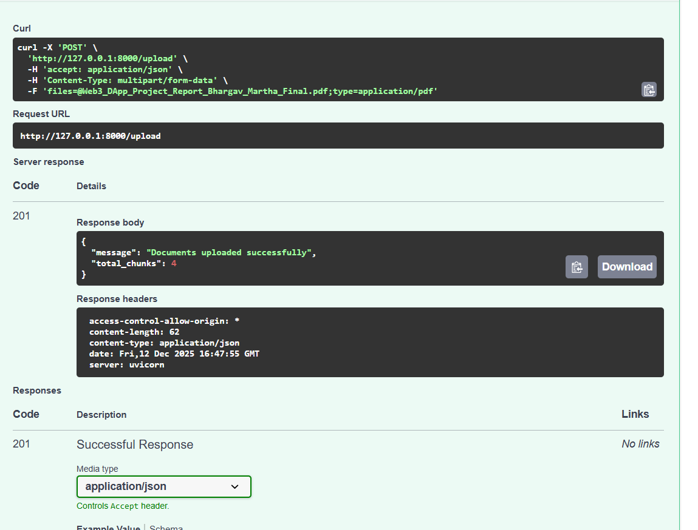
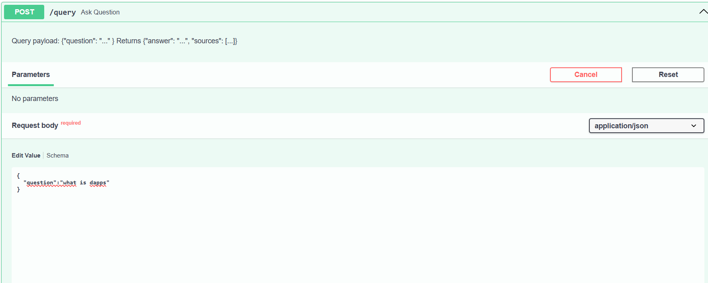

# RAG Service — Document Question Answering

This project implements a Retrieval-Augmented Generation (RAG) workflow. Users can upload documents, ask questions, and receive grounded, context-aware answers generated using an LLM.

## Overview

The system includes:

1. Document Processing
- Extracts text from PDF, TXT, and DOCX files  
- Splits text into overlapping chunks  
- Generates embeddings using SentenceTransformers  

2. Vector Database
- Uses ChromaDB (persistent mode)  
- Stores all chunks and embeddings  
- Performs semantic similarity search  

3. Question Answering
- Embeds user question  
- Retrieves top-k relevant chunks  
- Generates an answer using an OpenAI model  
- Returns both the answer and source chunks  

4. Frontend UI
- Upload documents  
- Ask questions  
- View answers  
- View sources  
- View system report  

## Project Structure

rag-service/
│
├── app/
│   ├── main.py
│   ├── document_processor.py
│   ├── embeddings.py
│   ├── vector_store.py
│   ├── llm.py
│
├── frontend/
│   ├── index.html
│   ├── app.js
│   ├── style.css
│
├── data/
│   ├── uploads/
│   └── db/
│
├── requirements.txt
├── .gitignore
└── README.md

## Installation & Setup

1. Clone the repository

2. Create a virtual environment

3. Install dependencies

4. Add OpenAI API key  
Create a `.env` file:

5. Run FastAPI server

Backend runs at:
http://127.0.0.1:8000

The frontend loads automatically from the same server.

## API Documentation

### POST /upload
Upload one or multiple documents.

Example:
curl -X POST "http://127.0.0.1:8000/upload" -F "files=@sample.pdf"


Response:
{
"message": "Documents uploaded successfully",
"total_chunks": 12
}


### POST /query

Request:
{
"question": "What is blockchain?"
}

makefile
Copy code

Response:
{
"answer": "Blockchain is a decentralized ledger...",
"sources": ["chunk text here"]
}


### GET /report

curl http://127.0.0.1:8000/report


Response:
{
"total_documents": 2,
"total_chunks": 17,
"top_k": 3,
"context_precision": 0.9,
"faithfulness": 0.85
}


## Using the Frontend

Open browser:
http://127.0.0.1:8000


Features:
- Upload documents
- Ask questions about them
- View answers and retrieved chunks
- View system report


## Technologies Used

Component | Library/Tool  
--------- | -------------  
API | FastAPI  
Embeddings | SentenceTransformers MiniLM-L6-v2  
Vector DB | ChromaDB  
LLM | OpenAI GPT-4o Mini  
Frontend | HTML, CSS, JavaScript  
Language | Python 3.13  

Supported file types:
- .pdf
- .txt
- .docx

Note: .md files are not processed by the service by default.

Included sample document for testing:
- sample-docs/sample.txt


### Screenshots
Screenshots: add `screenshots/upload.png`, `screenshots/query.png`, `screenshots/report.png` into the repo and reference them here.
Upload:  


Query response:  


Report:  


## 📹 Demo Video
🔗 ## 📹 Demo Video
🔗 https://drive.google.com/file/d/1FwA8NOwoSSatzWVn5v0MMHNs4kfIOncT/view?usp=drivesdk


## Author

Bhargav Martha

## Requirements
- Python 3.9+
- .env with OPENAI_API_KEY
- Install: `pip install -r requirements.txt`

## Run locally
```bash
python -m venv .venv
source .venv/Scripts/activate  # Git Bash
pip install -r requirements.txt
python -m uvicorn app.main:app --reload
